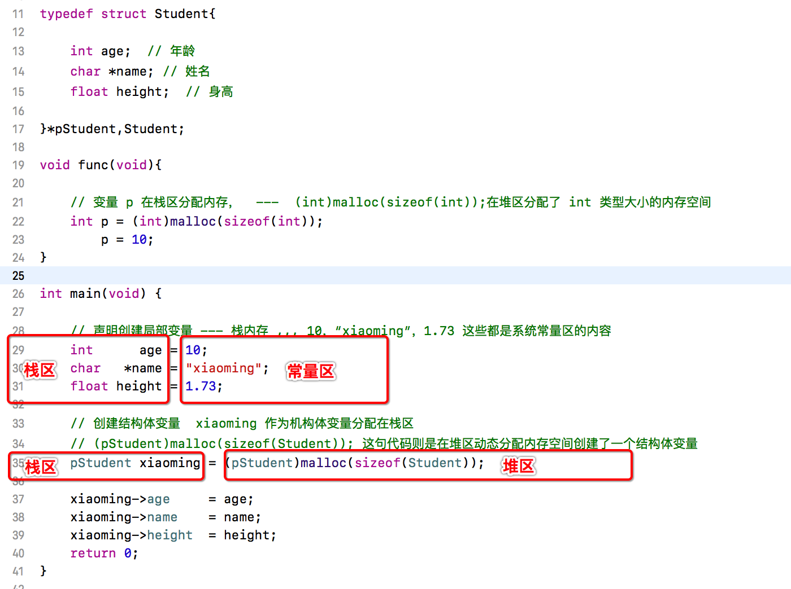
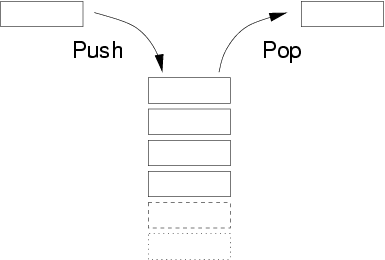
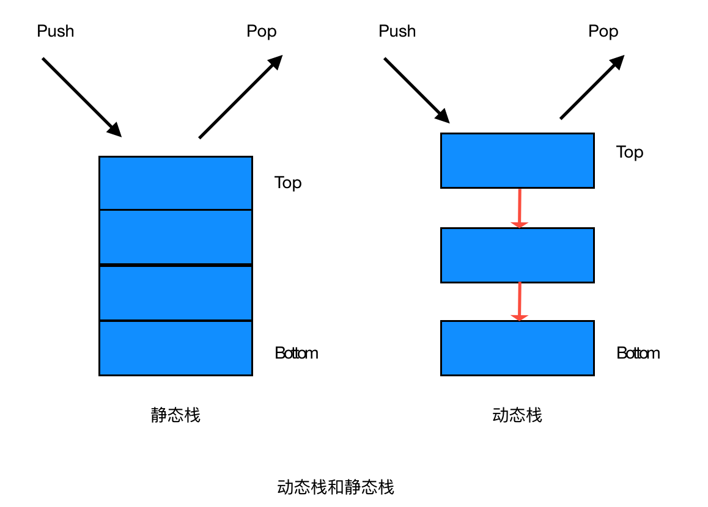
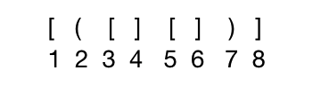

# 数据结构(三)--栈

通常程序开发中内存管理是非常重要的，而内存主要分为占内存和堆内存。那么栈和堆内存有什么区别呢？希望在这篇文章里能带你找到答案！

## 1. 栈和堆的引入 

在一个简单的程序中我们定义和声明几个基本类型的变量、结构体和数组，先来直观看一下栈和堆的不同：



- 静态变量 和 局部变量是以压栈出栈的方式分配内存的，系统会在一个代码段中分配和回收局部变量，实际上每个代码段、函数都是一个或多个嵌套的栈，我们不需要手动管理栈区内存。
- 动态内存是一种堆排序的方式分配内存的，内存分配好后便不会自动回收，需要程序员手动回收。否则就会造成内存泄漏，内存越用越少。

简单了解了一下程序中内存栈与堆的区别，下面就正式开始讲数据结构中的栈。
(注意：数据结构栈、内存栈、函数调用栈三者在含义上略有不同，但是其核心思想和理念是相同的)

## 2. 栈的定义

栈是一种“先进后出”的一种数据结构，有压栈出栈两种操作方式。如下图：




## 3. 栈的分类

栈主要分为两类：

- 静态栈
- 动态栈

**【静态栈】**

静态栈的核心是数组，类似于一个连续内存的数组，我们只能操作其栈顶元素。


**【动态栈】**

静态栈的核心是数组，类似于一个连续内存的数组，我们只能操作其栈顶节点。




## 4. 栈的算法

栈的算法主要是压栈和出栈两种操作的算法，下面我就用代码来实现一个简单的栈。

首先要明白以下思路：

- 栈操作的是一个一个节点
- 栈本身也是一种存储的数据结构
- 栈有`初始化`、`压栈`、`出栈`、`判空`、`遍历`、`清空`等主要方法


### 4.1 栈的头文件定义

头文件定义如下：

```c
typedef struct Node{    // 节点
    
    int data;
    struct Node *pNext;
    
}*PNODE,NODE;

typedef struct Stack{   // 栈
    
    PNODE pTop;
    PNODE pBottom;
    
}STACK,*PSTACK;

/**栈的初始化*/
void init(PSTACK);
/**压栈*/
void push(PSTACK,int);
/**出栈*/
int pop(PSTACK , int *);
/**遍历打印栈*/
void traverse(PSTACK);
/**是否为空栈*/
int isEmpty(PSTACK);
/**清空栈*/
void clearStack(PSTACK);
```

有了头文件定义，基本就确定了栈的使用结构和使用方式。下面是在主函数中对这个栈的创建和使用。

```c
int main(void){
    
    STACK stack;  // 声明一个栈
    init(&stack);   // 初始化
    
    // 压栈
    push(&stack, 10);
    push(&stack, 20);
    push(&stack, 30);
    push(&stack, 40);
    push(&stack, 50);
    
    traverse(&stack);   // 遍历打印栈
    
    int val;
    int isPopSuccess = pop(&stack,&val);
    if (isPopSuccess) {
        printf("pop 的值为 %d\n",val);
    }
    
    traverse(&stack);
    
    clearStack(&stack);   // 清空栈
    traverse(&stack);
    
    return 0;
}
```

### 4.2 栈的初始化

思路：
拿到栈声明的指针，开辟一块内存空间给栈顶栈底，此时是一个空栈，栈顶栈底指向同一块内存，且栈底栈顶以外不再指向其他节点。

```c
/**栈的初始化*/
void init(PSTACK pS){
    
    pS->pTop = (PNODE)malloc(sizeof(NODE));
    if (pS->pTop == NULL) {
        printf("内存分配失败退出");
        return;
    }else
    {
        pS->pBottom = pS->pTop;
        pS->pTop->pNext = NULL;
    }
}
```

### 4.3 压栈 和 出栈

思路：
压栈是把新的节点放入栈顶，且每次压栈操作只能将新的节点放到栈的顶部。
出栈需判断是否原本为空栈，存在出栈失败的情况，把栈顶指向栈顶元素的下一个元素，并释放原来栈顶元素空间。

```c
/**
 压栈

 @param pS 执行压栈的栈指针
 @param val 被压栈的值
 */
void push(PSTACK pS,int val){
    
    // 创建新节点，放到栈顶
    
    PNODE pNew = (PNODE)malloc(sizeof(NODE));
    pNew->data = val;
    pNew->pNext = pS->pTop;
    
    pS->pTop = pNew;    // 栈顶指针指向新元素
}

/**
 出栈

 @param pS 执行出栈的栈地址
 @param val 出栈值的地址
 @return 是否出栈成功
 */
int pop(PSTACK pS , int *val){
    
    if (isEmpty(pS)) {
        printf(" 空栈 ，出栈失败");
        return 0;
    }else
    {
        PNODE p = pS->pTop;
        pS->pTop = p->pNext;
        
        if (val != NULL) {
            *val = p->data;
        }
        free(p);                // 释放原来top内存
        p = NULL;
        return 1;
    }
}

/**是否为空栈*/
int isEmpty(PSTACK pS)
{
    if (pS->pTop == pS->pBottom) {
        return 1;
    }else
    {
        return 0;
    }
}
```

### 4.4 栈的清空 和 遍历

当一个代码段执行完成之后，实际上就是这个栈所有分配的空间都被回收，栈随之被清空！

思路：
栈清空，实际就是需要循环执行出栈操作。
栈遍历，实际就是栈元素从栈顶一个个遍历到栈底，可以打印栈中元素的值

```c
/**清空栈*/
void clearStack(PSTACK pS){
    
    if (isEmpty(pS)) {
        return;
    }else{
        PNODE p = pS->pTop;
        PNODE q = NULL;
        
        while (p!=pS->pBottom) {
            q = p->pNext;
            free(p);        // 释放原栈顶元素空间
            p = q;
        }
        pS->pTop = pS->pBottom;
    }

    
//    偷懒的做法
//    while (!isEmpty(pS)) {
//        pop(pS, NULL);
//    }
}


/**遍历打印栈*/
void traverse(PSTACK pS){
    
    // 只要不是空栈，就一直输出
    PNODE p = pS->pTop;
    while (p != pS->pBottom) {
    
        printf("%d   ",p->data);
        
        p = p->pNext;  // 把top的下一个节点付给top，继续遍历
    }
    printf("\n");
}
```


## 5. 栈的应用

栈结构固有的先进后出的特性，使它成为在程序设计中非常有用的工具，这里列举几个典型的例子。

### 5.1 数制转换

十进制数 N 和其他 d 进制数的转换是计算机实现计算的基本问题，其解决方法有很多种，其中一个简单的方法基于如下原理：
`N = (N div d) * d + N mod d `(其中div是整除运算，mod 为求余运算)
例如：1348(10进制) == 2504(8进制)运算过程如下：

N | N div 8 | N mod 8
-----| ----|---------
1348 | 168 | 4
168  | 21  | 0
21   | 2   | 5
2    | 0   | 2

**需求:** 输入一个任意非负十进制整数，打印输出其对应的八进制整数

**思路:** 由于上述计算过程是从低到高位顺序产生八进制数的各个数位，而打印输出，一般来说应从高位到低位进行，恰好和计算过程相反。因此可利用栈先进后出特性，将计算过程中得到的八进制数各位顺序进栈，再按出栈序列打印输出既为与输入对应的八进制数。

```c
void conversion(void){
    
    // 创建栈
    STACK S;
    init(&S);
    
    // 用户输入十进制数
    scanf("%d",&N);
        
    // 放入栈中
    while (N) {
        push(&S, N % 8);
        N = N / 8;
    }
    
    // 打印出来
    printf("对应八进制数字为:");
    int a;
    while (!isEmpty(&S)) {
        pop(&S, &a);
        printf("%d",a);
    }
    printf("\n");
}

```

>**思考** 用数组实现貌似更简单，为什么不用数组？
> 从算法上分析不难看出，栈的引入简化了程序设计的问题，划分了不同的关注层次，使思考范围缩小了。而使用数组不仅掩盖了问题的本质，还要分散精力去思路数组下标增减等细节问题。
> 这也是早期面向对象编程的一种思想，要把对应的功能划分关注层次，在逻辑的实现上面更加专注问题的本质。

### 5.2 括号匹配的检验

编程语言中基本都允许使用 `(),[],{}`这几种括号，假设现在让使用两种，一段完整代码中其须成对匹配，检验括号是否匹配的方法可用"期待的紧迫程度"这个概念来描述。




当计算机接受了第一个括号后，它期待着与其匹配的第八个括号出现，然而等来的确实第二个括号，此时第一个括号`[`只能暂时靠边，而迫切等待与第二个括号匹配的第七个括号`)`出现，类似地，等来的是第三个括号`[`，其期待的匹配程度比第二个更加急迫，则第二个括号也只能靠边，让位于第三个括号，显然第二个括号的期待急迫性高于第一个括号，在接受了第四个括号之后，第三个括号的期待得到满足，消解之后，第二个括号的期待匹配变成最紧迫的任务了·····，以此类推。

可见此处理过程与栈的特点相吻合，由此，在算法中设置一个栈，每读入一个括号，若是右括号则使至于栈顶的最紧迫的期待得以消解，若是不合法的情况（左括号），则作为一个新的更紧迫的期待压入栈中，自然使原来所有未消解的期待的紧迫性都降了一级。另外在算法开始和结束的时候，栈都应该是空的。

算法实现：

```c
/**
 检测括号(本实例用数字代替括号)
 
 [ ]    -->    1 , 2
 ( )    -->    3 , 4
 
 */
void checkBracelet(void)
{
    // 创建栈
    STACK S;
    init(&S);
    
    // 用户输入括号
    int N;
    printf("请输入对应的括号(end结束):\n");
    scanf("%d",&N);
    
    if (isEmpty(&S)) {
        push(&S, N);
        printf("第一个括号输入\n");
        traverse(&S);       // 打印此时栈内容
    }
    
    while (!isEmpty(&S)) {

        // 用户输入括号
        int N;
        printf("请输入对应的括号(0结束):\n");
        scanf("%d",&N);
        
        if (N == 0) {
            break;  // 用户输入0直接退出
        }
        
        // 判断当前栈顶是否符合标准，
        if (S.pTop->data == N) {
            printf("消除一对\n");
            pop(&S, NULL);
            traverse(&S);       // 打印此时栈内容
        }else
        {
            printf("未消除\n");
            push(&S, N);
            traverse(&S);       // 打印此时栈内容
        }
    }
}
```

这里的实例我列举了两个，实际上还有很多。比如 **行编辑程序**、**迷宫求解**、**表达式求值**等。这里我就先不做列举了。

## 6. 小结

通过这里复习数据结构中栈的内容，感觉重新理解了很多计算机实现的底层知识，虽然不知道的更多，但是面对计算机心中又多了一层认知！

文中代码地址：[https://github.com/xiaoyouPrince/DataStructure](https://github.com/xiaoyouPrince/DataStructure)


