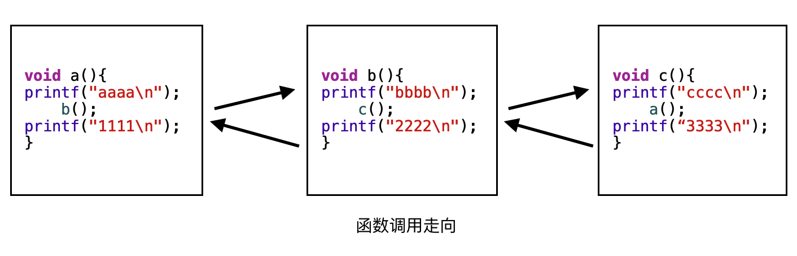
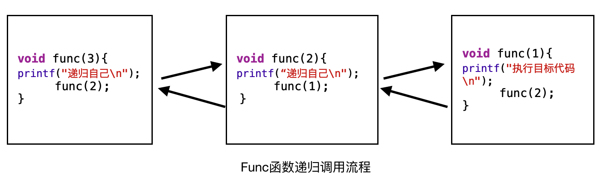

# 数据结构(五)--递归

**首先思考一个问题，当A函数调用B函数，A函数是如何调用B函数的？**

在一个函数调用期间，调用另一个函数时，在执行被调用函数之前，系统需要先完成三件事

1. 将所有的实在参数返回的地址等信息传递给被调用函数保存
2. 给被调函数的局部变量分配存储区
3. 将控制权限转移到被调函数的入口

而从被调函数返回到调用函数之前，系统也会完成三件工作

1. 保存被调函数计算结果
2. 释放被调函数数据区
3. 依照被调函数保存的返回值地址，将控制权限转移给调用函数

当有多个函数构成嵌套调用时，按照`后调用先返回`，函数之间的传递和控制转移，必须借助栈来实现。即系统将整个程序运行所需的数据空间放在一个栈中，每当调用一个函数时，就为它在栈顶分配一个存储区，每当从一个函数退出时就释放它的存储区，则当前正运行的函数数据区必须在栈顶。

**以上便是函数调用过程，也是本文学习递归知识的基础**

## 1. 递归的定义

**递归**指一个函数直接或者间接调用自己

**使用递归需要满足的三个条件:**

- 递归必须有一个明确的终止条件
- 该函数所处理的数据规模递减
- 这个转化必须是可解的

## 2. 不同函数之间的相互调用

了解了函数之间相互调用规则之后，来看一下不同函数之间相互调用的例子

假定有三个函数 a,b,c 之间相互调用.

```c
void a(){
    printf("aaaa\n");
    b();
    printf("1111\n");
}

void b(){
    printf("bbbb\n");
    c();
    printf("2222\n");
}

void c(){
    printf("cccc\n");
//    a();  // 想想这里调用a会出现什么情况？
    printf("3333\n");
}

int main() {
    a();
    return EXIT_SUCCESS;
}
```

打印结果如下

```c
aaaa
bbbb
cccc
3333
2222
1111
```

由此结合函数间调用的流程可清楚看到函数执行过程中的走向如图



此时再想代码中注释的那行 `a()` 调用，很容易就能想清楚整体走向：即函数一直 a,b,c,a,b,c ... 循环调用，而没有返回，最终导致函数调用栈溢出，从而进程被系统杀死。这实际上造成了一个循环递归，类似于死循环

## 3.函数递归调用，自己调用自己

假定有一个函数 func() 

```c
void func(int num){
    if (num == 1){
        printf("执行目标代码\n");
    }
    else
    {
        printf("递归自己\n");
        func(num - 1);
    }
}

int main() {
    func(3);
    return EXIT_SUCCESS;
}
```

打印结果如下

```c
递归自己
递归自己
执行真实代码
```

集合函数调用流程可以得到如下函数调用路径


## 递归实例

本小节列举了以下几种情况的递归实例

- 求阶乘
- 求和 
- 汉诺塔问题

### 实例1，求数字 n 的阶乘

**阶乘**即一个数从 n * (n-1) * (n-2) * ... * 1;用数学表示为 **n!**

求阶乘可以根据定义用循环法、也可以用递归法。下面分别用两种方法来求解阶乘

**普通的循环法求阶乘**

```c
int getFactorial(int num){
    
    // 0 验证入参为大于0的整数
    if (num<1) {
        return 0;
    }
    
    
    int result = num;
    
    // 1. for 循环求解
    for( int i = num-1; i >= 1; i--){
        result = i * result;
    }
    return result;  
}
```

使用递归方式

```c
int getFactorial(int num){
    
    
    // 0 验证入参为大于0的整数
    if (num<1) {
        return 0;
    }
    
    int result = num;
    // 2. 递归求解
    if (num == 1) {
        return 1;
    }else
    {
        return result * getFactorial(num-1);
    }
    return result;  
}
```
由于 int 类型限制，求到的结果最大为 32bit。即-2^31~2^31-1范围大小，因此它们能表示的整数范围为-2147483648~2147483647，所以上面函数能求到的最大阶乘数字为11.如果入参超过11即int值表达的数字内存溢出。实际使用应该根据需求使用更大的类型值。

### 实例2 求数字 1+2+3+ ... +n 的累加之和

此问题也可用两种方法来分别求解。

**for循环求累加**

```c
/// 求一个数字的累加和
unsigned long getSum(int num){
    
    // 0 验证入参为大于0的整数
    if (num<1) {
        return 0;
    }
    
    unsigned long result = num;
    // 1. for 循环求解
    for( int i = num-1; i >= 1; i--){
        result = i + result;
    }
    return result;
}
```

**递归求累加之和**

```c
/// 求一个数字的累加和
unsigned long getSum(int num){
    
    // 0 验证入参为大于0的整数
    if (num<1) {
        return 0;
    }

    unsigned long result = num;
    // 2. 递归求解
    if (num == 1) {
        return 1;
    }else
    {
        return result + getSum(num-1);
    }
    return result;
}
```

### 汉诺塔问题

汉诺塔是源自印度神话里面的玩具。
传上帝创造世界的时候做了三根金刚石柱子，在一个柱子上从上往下按照大小顺序摞着 64 片黄金圆盘
上帝命令婆罗门把圆盘从下面开始按照大小顺序重新摆放到另一根柱子上。并且规定，在小圆盘的上面不能放大圆盘，在三根柱子之间一次只能移动一个圆盘。

如图可以示意一个三层汉诺塔问题：


根据示意图结合递归思路。可以总结归纳出如下伪算法

```c
if(n == 1){
    直接将该盘子移动到 C 柱子上
}

if(n > 1){
    1. 先将 A 柱子上的前 n-1 个盘子从 A 借助 C 移到 B
    2. 将 A 柱子上的第 n 个盘子直接移动到 C
    3. 再将 B 柱子上的 n-1 个盘子借助 A 移动到 C
}
```

此处可以发现问题难度一下提升了很多，这样的问题再用循环似乎就无从下手了。只能从递归的角度思考，并且问题操作步骤过于复杂，我们只能分析出来每层步骤之间的关系来使用递归来处理问题。有兴趣的话好好思考并感受一下递归的优势。

源码请见代码文件


## 递归和循环的关系

从上面的例子中可以发现，同一个问题既可以用循环实现也可以使用递归实现，它们之间由于实现方式不同，其各自的优缺点也是显而易见的。

**递归：**

- 易于理解
- 速度慢(函数调用需要开辟更多内存空间，传递各种参数)
- 需要存储空间大

**循环**

- 不易理解
- 速度快（不会新开辟空间，也没有额外参数传递）
- 占用存储空间小

**虽然递归有一些显著的缺点，但是在解决一些树、图等复杂数据结构问题的时候，只能用递归来处理**

### 递归的应用

数据结构后面会讲到树、森林、图等数据结构，这些非线性的复杂的数据结构的很多算法都是使用递归来实现的。

很多数学公式就是以递归的方式来定义的:

如斐波拉切序列： 1 2 3 5 8 13 21 34 ...   **后面一个数是前两项之和**

## 小结

递归在很多小问题面前，几乎没有优势，建议用循环方式处理。但是需要理解递归的思路，**只理解递归两层之间的交接，以及递归终结的条件**。当遇到一些复杂问题的时候才是递归真正发挥作用的时候。

本小节是后续数据结构**树**和**图**的基础，欢迎持续关注...

